# **POKÉMON GO**

## Índice

* [1. Definición del producto](#1-definición-del-producto)
* [2. Principales usuarios](#2-princiaples-usuarios)
* [3. Objetivos del usuario en relación al producto](#3-objetivos-producto)
* [4. Ventajas para el usuario](#4-ventajas-usuario)
* [5. Prototipo](#5-prototipo)
* [6. Feedback Compañeras](#6-feedback-compañeras)
* [7. Historias de Usuario](#7-historias-de-usuario)

***

## **1. Definición del producto**

Esta página web le permitirá a los jugadores online de pokémon conocer datos específicos de sus personajes favoritos, logrando por medio de filtros encontrar con mayor facilidad los pokémones de su preferencia.

## **2. Principales Usuarios**

Jugadores de pokémon Online

## **3. Objetivos del usuario en relación al producto**

- Lograr que el usuario pueda visualizar los pokémones con sus características principales
- Permitir que el usurio encuentre estadísticas de los poderes
- Permitir al usuario por medio de filtros encontrar pokemones de acuerdo a sus resistencias, debilidades y tipo.

## **4. Ventajas para el usuario**

El usuario al ingresar a la página web podra:
- Conocer las características de los pokemones
- Lograr por medio de filtros encontrar información especifica
- Conocer estadísticas acerca de los poderes 

## **5. Prototipo**

### Link FIGMA ###

(https://www.figma.com/file/CfvF3kRX53qId9H6ZGbRYj/PokemonLovers?node-id=0%3A1&t=ZjZjbsgUklB7UZAx-0)

### **5.1 Prototipo Móvil**

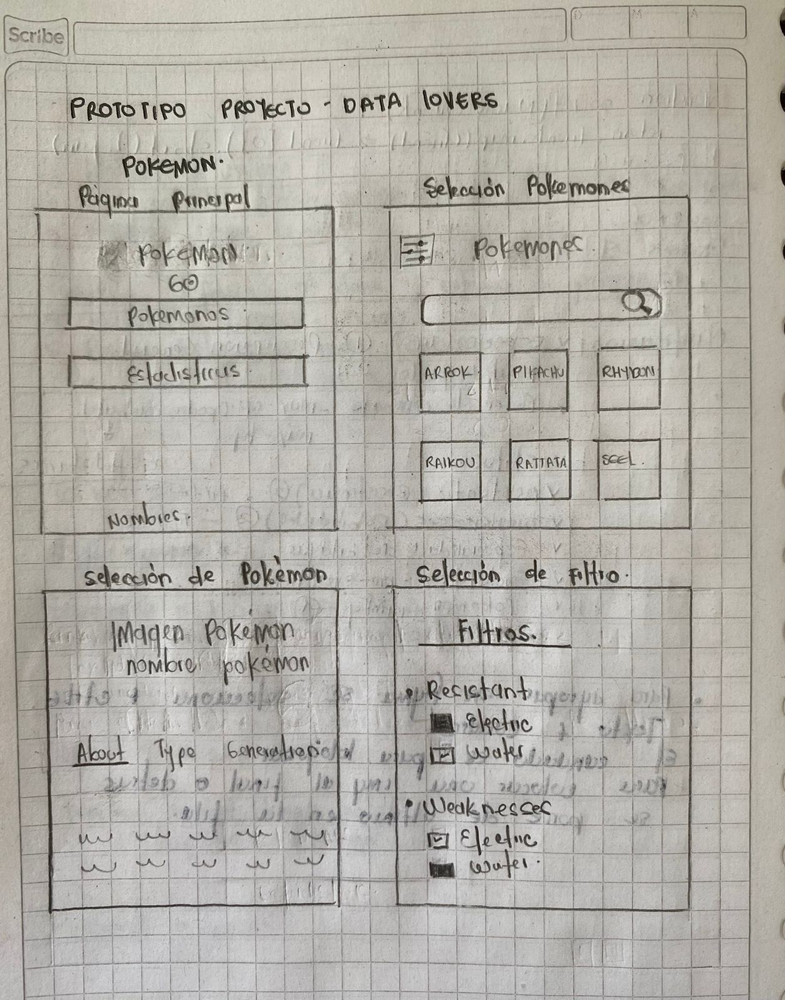

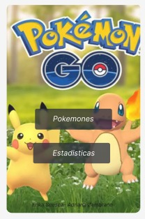

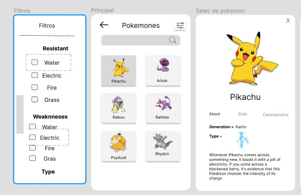

### **5.2 Prototipo Desktop**

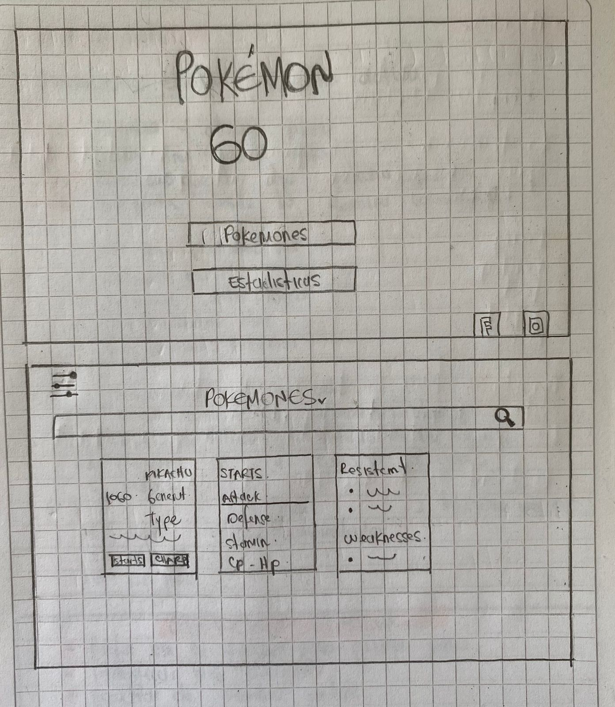

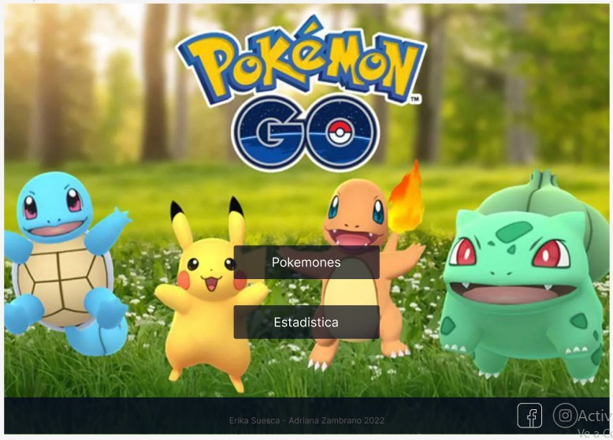

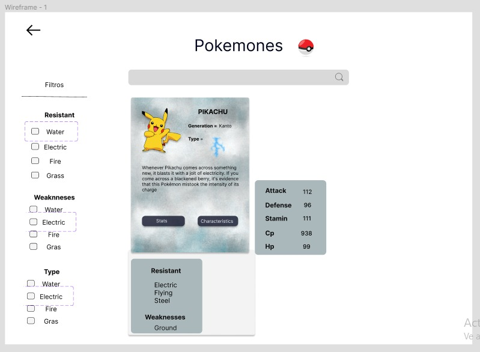

### **5.3 DISEÑO FINAL PROYECTO**

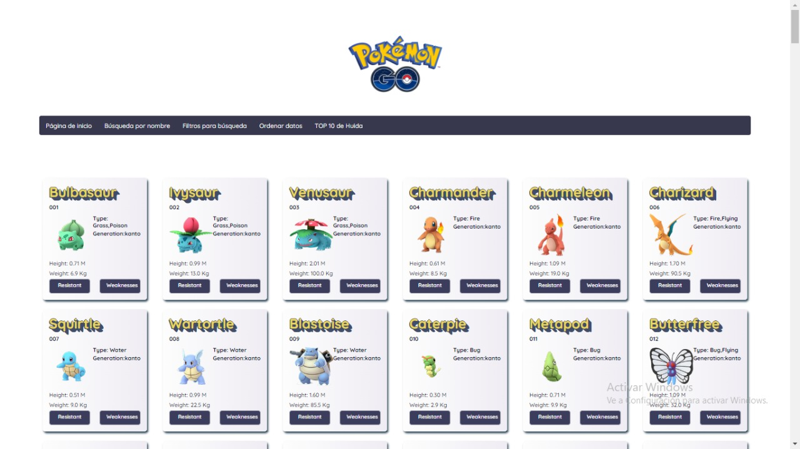

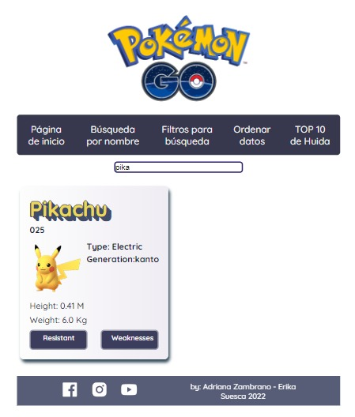

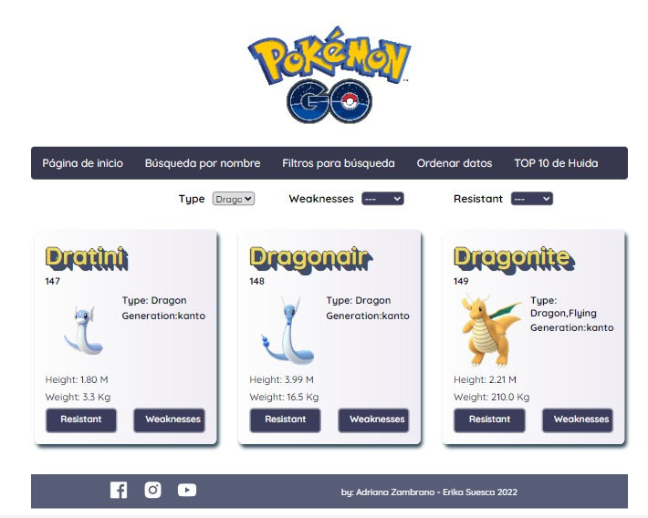

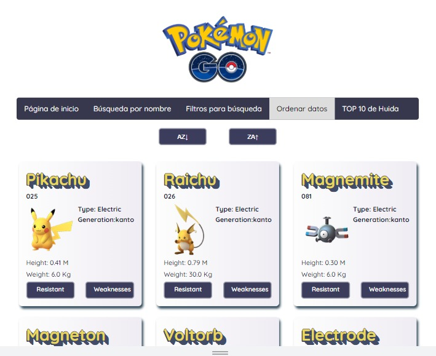

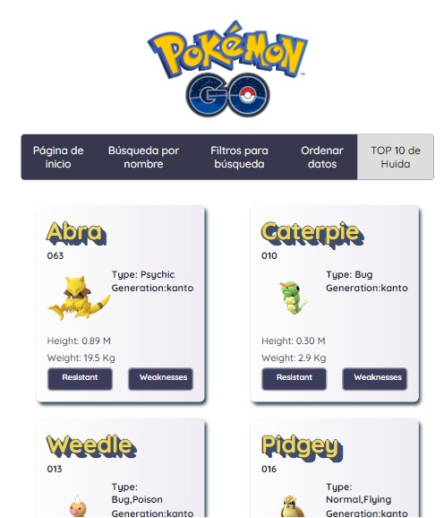

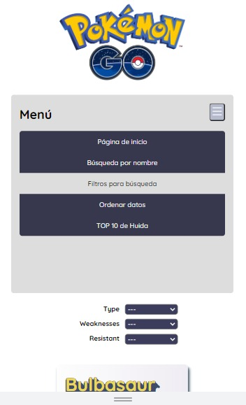

### **6. Feedback Compañeras**
 
 - Nos dieron recomedaciones acerca del prototipo inical que teniamos, el cual lo cambiamos por que por la imagen no se veía bien.
 - Colocar todo en una sola página

### **7.Historias de usuario**

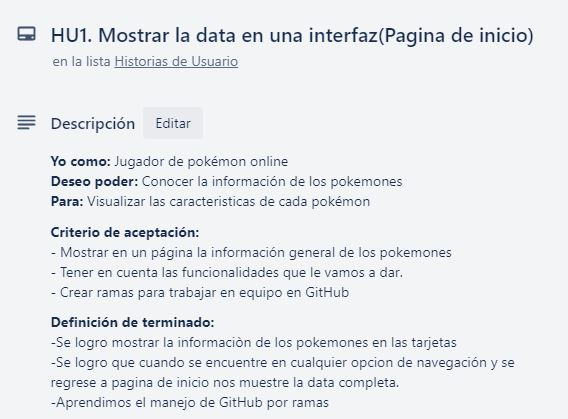
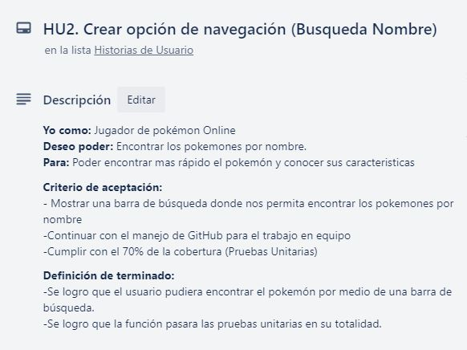
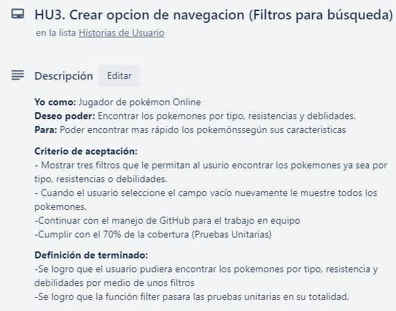
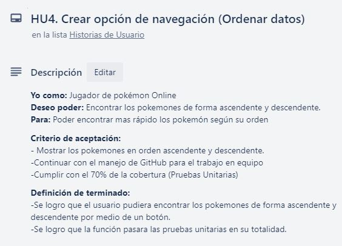
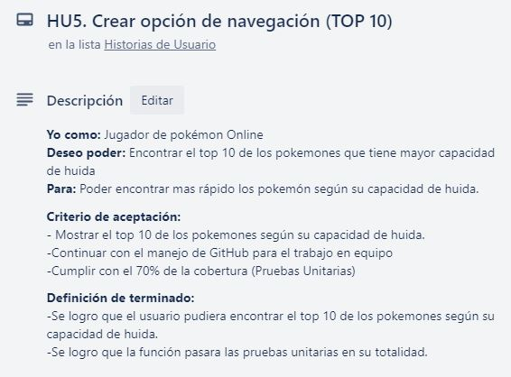
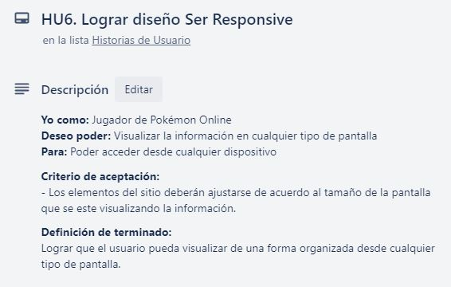
