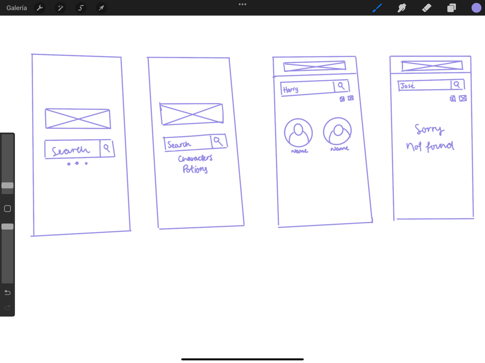
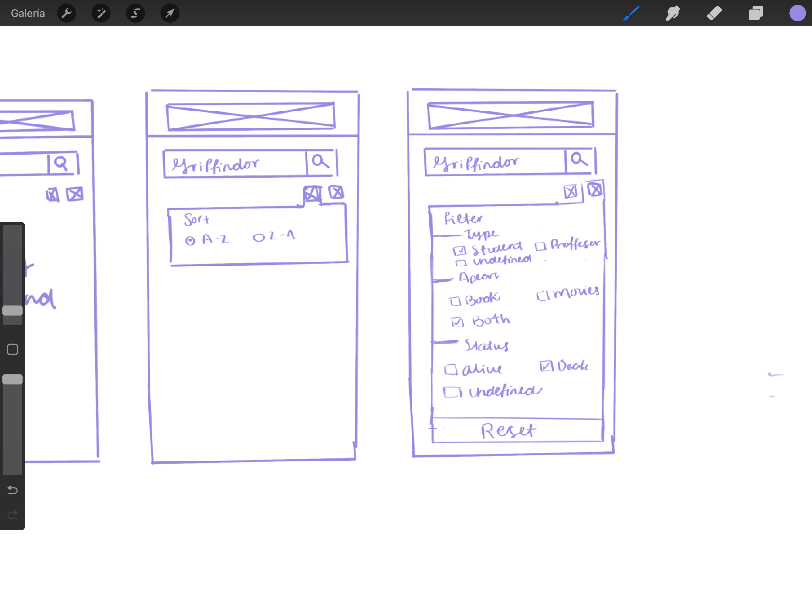
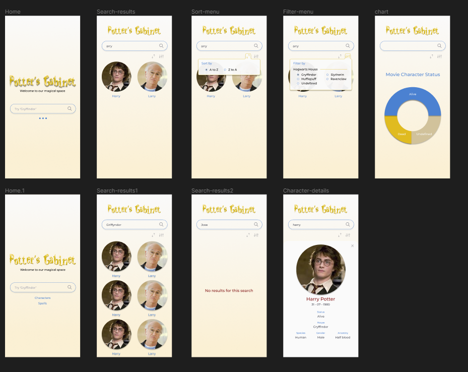
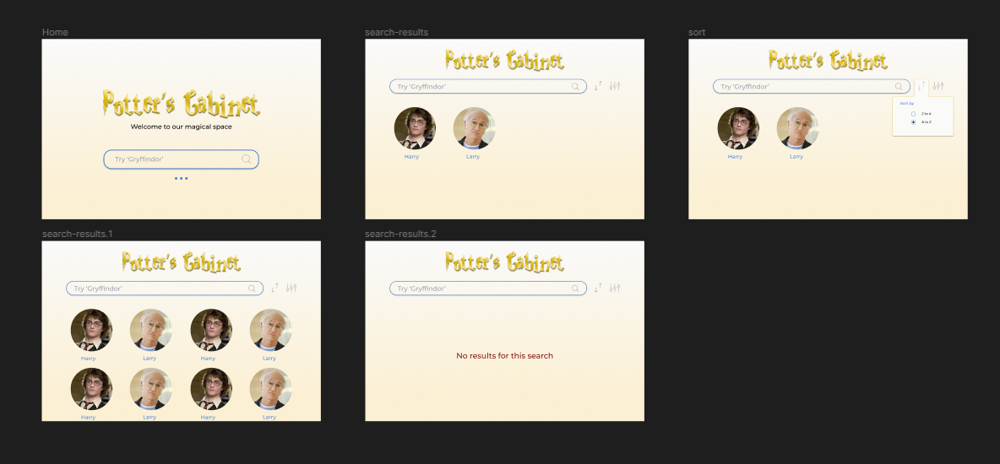

# Potter's Cabinet
Harry's Cabinet es una aplicación sobre personajes de Harry Potter apta para computadoras y teléfonos móviles ya que cuenta con un diseño responsive para distintos tamaños de pantallas.

Los principales usuario de nuestra aplicación son los fans o personas interezadas en el mundo de Harry Potter que quieran profundizar sobre los datos de los personajes. Es por esto que nuestra aplicación les entrega, en primera instancia, los nombres y las respectivas imágenes de los personajes; en caso de que quieran saber más sobre ellos, les permite filtrar la información presentada, como por ejemplo, la casa a la que pertenecen; y, una vez que seleccionan a un personaje, les muestra información específica sobre ellos.

Contemplamos que el uso de Harry's Cabinet sea cada vez que nuestros usuarios quieran saber más sobre los personajes de esta franquicia o, bien, requieran saber cuáles personajes pertenecen a cada casa.

## Historias de usuario
Para nuestras historias de usuario, comenzamos identificando a 3 usuarios objetivo. De esta manera, podemos entenderlos de mejor manera y, así, entregarles una historia de usuario acorde a sus requerimientos.

* Los usuarios objetivos de nuestro proyecto son los siguientes (identificados como una persona en especial):

1. Fans

        Nombre:
        Emma

        Edad:
        23 años

        Nacionalidad:
        Canadiense

        Idioma:
        Inglés

        Historia:
        Creció con las películas de Harry Potter y, ahora, quiere asistir a una convencion de fans donde habrán concursos sobre la saga pero utilizando de referencia los libros.

        Problema a resolver con la aplicación:
        Tiene muy mala memoria para recordar detalles específicos de los personajes (como lo es en qué libro aparecen).

        Solución: 
        La aplicación le permite filtrar a los personajes por la aparición en los libros y otros datos más sobre los mismos.

2. Personas interezadas en saber más sobre el mundo mágico

        Nombre:
        Harry

        Edad:
        35 años

        Nacionalidad:
        Británica

        Idioma:
        Inglés

        Historia:
        Harry tiene amigos que son fan de Harry Potter, pero él no sabe nada sobre esta franquicia y tampoco le interesa leer o ver las películas. Sus amigos lo apodan "The Boy Who Lived" porque se llama como el protagonista y no le dan el contexto de por qué ese apodo.

        Problema a resolver con la aplicación:
        Quiere saber por qué lo apodan de esa manera y saber más sobre el personaje sin tener que leer los libros ni ver películas.

        Solución:
        La aplicación le entrega los datos que solicita sobre Harry Potter.

3. Estudiantes

        Nombre:
        Sofía

        Edad:
        13 años

        Nacionalidad:
        Argentina

        Idioma:
        Español

        Historia:
        En el curso de inglés de su escuela, le solicitan leer los libros de Harry Potter en su idioma original para que aprenda nuevas palabras y poder mejorar su conocimiento de la cultura británica ya que los libros cuentan con modismos propios de la cultura de origen.

        Problema a resolver con la aplicación:
        Repasar la información de los personajes para las pruebas de comprensión lectora del curso de inglés.

        Solución:
        La aplicación la ayuda a visualizar los personajes (por la descripcción física, como el color del cabello y ojos) y a relacionarlos por casas, tipos de patronus, etc.

Con estos datos, comenzamos a crear las siguientes historias de usuario:

* Primera historia de usuario:
        Como usuarios queremos una página web en la que podamos ver los personajes de Harry Potter (nombre e imagen).
        
        Criterios de Aceptación:
                * Fiel a prototipo
                * Visualización del personaje (nombre e imagen)
                * Se puede hacer scroll
                * Responsive design (movil, pc)
        Definition of done:
                * Poseemos feedback de la HU
                * Pasa los tests
                * Realizamos deploy
                * Subimos el código a GitHub

* Segunda historia de usuario:
        Como usuarios queremos buscar nombres de personajes y verlos en la pantalla (nombre e imagen).
        
        Criterios de Aceptación:
                * Fiel a prototipo
                * Visualización del resultado de la búsqueda (personaje con nombre e imagen)
                * Se puede hacer scroll
                * Responsive design (movil, pc)
        Definition of done:
                * Poseemos feedback de la HU
                * Pasa los tests
                * Realizamos deploy
                * Subimos el código a GitHub

* Tercera historia de usuario:
        Como usuarios queremos ordenar los nombres de los personajes en orden alfabético y de manera inversa.
        
        Criterios de Aceptación:
                * Fiel a prototipo
                * Visualización de las opciones para ordenar la información
                * Se puede ordenar la información en orden alfabético
                * Se puede ordenar la información de manera inversa (Z-A)
                * Se puede hacer scroll
                * Responsive design (movil, pc)
        Definition of done:
                * Poseemos feedback de la HU
                * Pasa los tests
                * Realizamos deploy
                * Subimos el código a GitHub

* Cuarta historia de usuario:
        Como usuarios queremos agregar filtros a la búsqueda (casa a la que pertenecen los personajes, si están vivos o no y si son muggles) para obtener resultados más específicos.
        
        Criterios de Aceptación:
                * Fiel a prototipo
                * Visualización de las opciones para filtrar
                * Se puede filtrar según las casas de Hogwart
                * Se puede hacer scroll
                * Responsive design (movil, pc)
        Definition of done:
                * Poseemos feedback de la HU
                * Pasa los tests
                * Realizamos deploy
                * Subimos el código a GitHub

## 🛠 Skills
JavaScript | HTML | CSS | Jest

## Paleta de Color Principal

| Color             | Hex                                                                |
| ----------------- | ------------------------------------------------------------------ |
| Rojo |  #841818 |
| Amarillo |  #E0BB20 |
| Azul |  #4B81D1 |
| Beige |  #D1C29B |
| Blanco |  #FAFAFA |
| Negro |  #000000 |

## Prototipos para el proyecto

* Prototipo de baja fidelidad

* Prototipo de alta fidelidad

