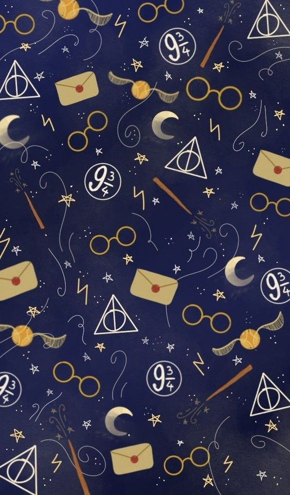
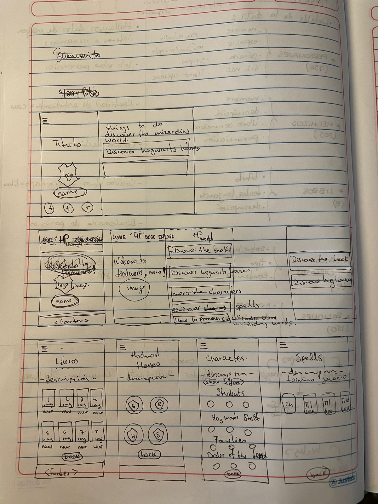
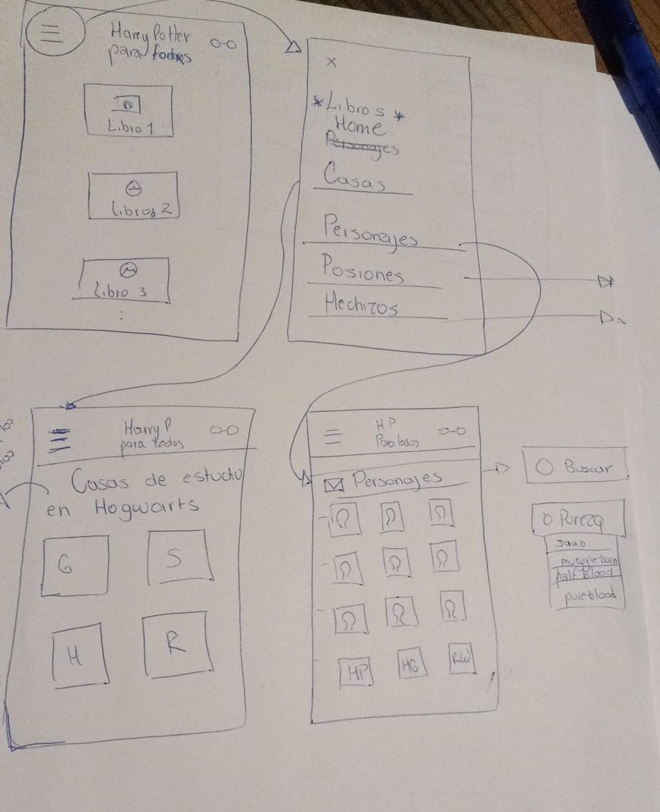
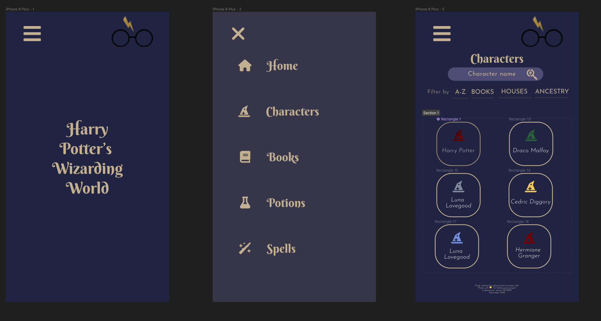
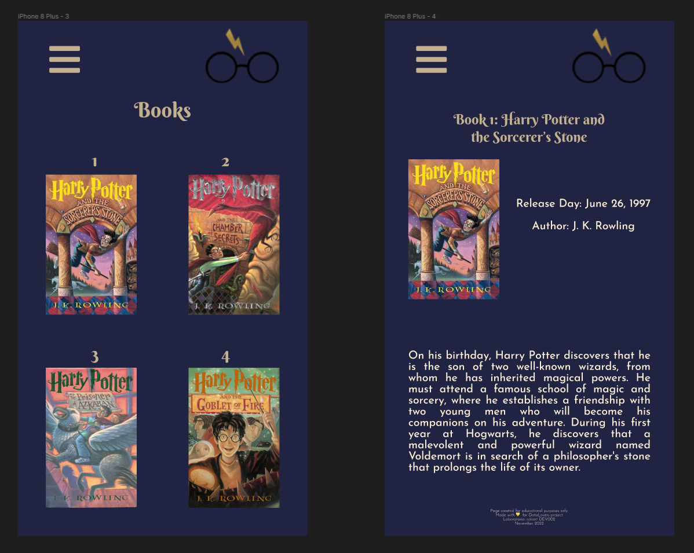
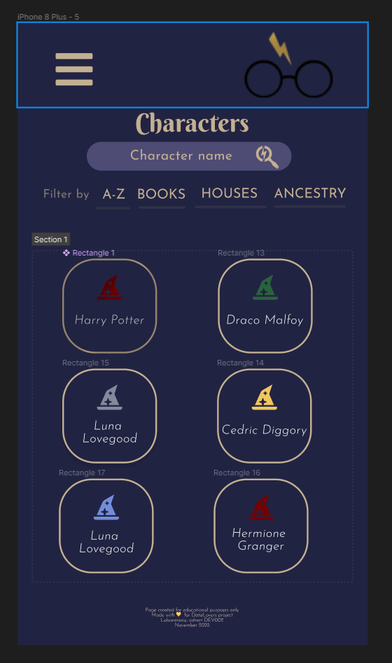

# Data Lovers
Con 💛 desde Perú y México

**Kamila Ojeda y Berenice Hernández**

***
## Indice

* [Harry Potter's Wizarding World](#✨-harry-potters-wizarding-world-✨)
* [Proceso de creación](#proceso-de-creación)
* [1. Primeros pasos](#1-primeros-pasos)
* [2. Investigación](#2-investigación)
* [3. Historias de Usuario ](#3-historias-de-usuario)
* [4. Diseño](#4-diseño)
* [5. Flujo de trabajo Git y GitHub](#5-flujo-de-trabajo-git-y-github)
* [6. Historia de usuario 1](#6-historia-de-usuario-1)
* [7. Pruebas unitarias]()
* [8. Deploy]()


***
# ✨ Harry Potter's Wizarding World ✨

Página web donde cualquier usuario puede consultar información relacionada al mundo mágico de Harry Potter, famosa saga escrita por J.K. Rowling.

Encontrarás datos sobre:

- Personajes
- Libros
- Hechizos
- Posiones
- Datos curiosos

Los datos contenidos en el sitio están **basados estrictamente en los libros**, por lo tanto, las imagenes que se visualizan son aquellas realizadas por fans y no encontraras información sobre las películas.

***

## 👩🏻‍💻☕Proceso de creación ☕👩🏻‍💻

***

### **1. Primeros pasos**
* **Presentación**

Este proyecto se trabajó en duplas, por lo que antes de empezar a trabajar, nos presentamos. 

Conocer nuestros hábitos de estudio, tiempo disponible, expectativas, fortalezas y areas de oportunidad fueron factores claves para comprender a la otra y relacionarnos desde el respeto y la empatía. Este primer paso fue de los mas importantes. 

* **Organización**

Este fue un tema clave tambien para empezar, usabamos herramientas distintas para la organización de nuestros proyectos, pero una vez que presentamos las bondades que cada una de estas ofrecía optamos por utilzar ambas. 

  ✍🏻 **Notion** para hacer el vaciado de ideas y concentrado de información por sprint, incluyendo las reflexiones de cada ceremonia. 

  📅 **Trello** nos ayuda a organizar nuestro sprint, básicamente es en donde está nuestro planning. 

* **Elección de temática**

Elegimos trabajar con la data de ***✨Harry Potter✨*** ya que ambas estamos mas familiarizadas con el tema y nos interesó conocer mas acerca de los datos contenidos en los libros .

### **2. Investigación**
En este paso nos apoyamos de la información contenida en el repositorio original del proyecto. Adicional nos dimos a la tarea de invesigar en redes sociales tales como **Facebook** y **YouTube** sobre qué hablan o esciben los y las fans de esta saga, las preguntas base fueron las siguientes:

- ¿Quiénes son los principales usuarios de producto?
- ¿Cuáles son los objetivos de estos usuarios en relación con el producto?
- ¿Cuáles son los datos más relevantes que quieren ver en la interfaz y por qué?
- ¿Cuándo utilizan o utilizarían el producto?

Cabe mencionar que nos encontramos con algunos sitios ya existentes que nos ayudaron con inspiración sobre la forma de presentar el contenido.

* [harrypotter.fandom.com](https://harrypotter.fandom.com/wiki/Main_Page)
* [wizardingworld.com](https://www.wizardingworld.com/)
* [startingharrypotter.com](https://www.startingharrypotter.com/)

### **3. Historias de Usuario**
En esta parte del proceso nos encontramos con una actividad desconocida, fue de los partes que nos llevo mas tiempo construir. 

De incio nos documentamos de manera individual y revisiones en conjunto sobre el tema de la creacion de historias de usuario, criterios de aceptación, definición de terminado y división de historias de usuario en tareas. Las fuentes de las que nos apoyaron fueron, principalmente videos de YouTube y la guía que nos proporcionó Laboratoria:

* [How to create User Stories in Scrum](https://www.youtube.com/watch?v=ky6wFiF5vMk)
* [HOW TO DIVIDE USER STORIES INTO TASKS](https://www.youtube.com/watch?v=Ueq786iZ30I)
* [Guía para DataLovers](https://docs.google.com/presentation/d/e/2PACX-1vQhx9D36NjpH-Daea-ITPUDUzNL8ZiNAprq_7b5PSUrfutk45tEtaOLz2lmd8f54_5jX1hypDM8f8SM/pub?start=false&loop=false&delayms=60000&slide=id.g3ebf713c66_1_55)

Después de la revisión de la teórica sobre Historias de Usuario, nos dimos a la tarea de escribir las nuestras, al final tomamos una OH con un coach que nos dejó mas claro el tema. Finalmente, y considerando que **la mayor parte de la data es sobre los personajes** (Characters),  nuestras HU quedan de la siguiente forma:

    HU 1

    Yo como: usuario fan de Harry Potter
    Quiero: una lista de personajes de toda la saga
    Para: conocer su nombre

    Criterios de aceptación:
    1.1 El usuario puede visualizar una lista de todos los personajes de la saga
    1.2 El usuario puede buscar por nombre o apellido
    1.3 El usuario puede listar en orden alfabético todos los personajes

    Definción de terminado:
    * Uso de HTML semántico
    * Uso de selectores en CSS
    * Diseño responsivo
    * Uso de métodos y objetos en JS
    * Uso de métodos de arrays
    * Pruebas unitarias
    * Proyecto cargado en git y GitHub

### **4. Diseño**
Luego de terminar de escribir nuestras historias de usuario nos dimos a la taea de crear un pequeño sistema de diseño:

#### ***Paleta de colores***
Buscando un poco de inspiración en sitios como Pinterest, los colores base fueron tomados principalmente de esta imagen:



    --main-color: #212342;
    --secondary-blue: #4E4C75;
    --titles-color: #C2B091;

Los colores adicionales elegidos para relacionarlos con cada casa de estudio de Hogwarts fueron:

    --gryffindor-color: #740001;
    --slytherin-color: #2A623D;
    --ravenclaw-color: #728DDA;
    --hufflepuff-color: #F0C75E;

#### ***Fuentes***
Obetenidas de [Google Fonts](https://fonts.google.com/):
* Fuente principal: [Berkshire Swash](https://www.notion.so/Fuentes-d497c8aec554465784e5eb50c206ec6b#c8e6a5b8dfec40ca95227d3b8e27d21d)
para títulos y subtítulos
* Fuente secundaria: [Josefine Sans](https://www.notion.so/Fuentes-d497c8aec554465784e5eb50c206ec6b#85c097fd38034ae7bf0f11ad01020b2d) para textos descriptivos, parrafos, etc.

#### ***Sketchs***
La recomendación fue entregar un sitio resposivo por lo que nos basamos en la estrategia de diseño ***Mobile First***.

Tomamos papel y lápiz para poner nuestras primeras ideas sobre cómo nos imaginabamos que se vería nuestro sitio:




Luego de varias horas, nuestros primeros prototipos en [Figma](https://www.figma.com/file/ex5Lv94vp7sYRK4tTE9SeU/Harry-Potter-Web-Page?node-id=0%3A1&t=ksUvZkhpVimzv2mj-1) lucían así:

* Pantalla de incio/ Menú / Pantalla Characters


* Pantalla Books / Pantalla Libro 1


### **5. Flujo de trabajo Git y GitHub**
LLegado el momento de iniciar con el códgio, nos enfrentamos a un nuevo reto, hacer código juntas.
El reto principal fue organizar nuestro flujo de trabajo usando las herramientas como git y github. Esto ha sido un ir y venir lleno de aprendizajes, muchos errores y conflictos, después de iterar, investigar y probar, acordamos seguir el siguiente flujo:

* Flujo que siguió Kami:


* Flujo que siguió Bere:


### **6. Historia de Usuario 1**
Reflexionando acerca de la Historia de Usuario, nos dimos cuenta que para entregar algo funcional y no perder tiempo, solo era necesario empezar con la pantalla Characters, dado que solo nos concentraríamos en filtrar la data de este array **Characters** en especifico.




* ***Maquetación***

Nos aseguramos de usar HTML semántico

* ***Estilos***

Reseteamos estilos y definimos variables, tanto para colores como para fuentes:

```
* {
    margin: 0;
    padding: 0;
    box-sizing: border-box;
}

:root {
    --main-color: #212342;
    --secondary-blue: #4E4C75;
    --titles-color: #C2B091;
    --gryffindor-color: #740001;
    --slytherin-color: #2A623D;
    --ravenclaw-color: #728DDA;
    --hufflepuff-color: #F0C75E;
    --titles-font: 'Berkshire Swash', cursive;
    --secondary-font: 'Josefin Sans', sans-serif;
}

````
Nos apoyamos con Flexbox para el tema del diseño responsivo y el acomodo de las cards que contienen el nombre de cada personaje.


* ***Manejo de la data con JavaScript***

Tal como lo indica el README del proyecto, dividimos el código JavaScript en 2 archivos:

* **data.js**: donde se encuentran las funciones de filtrado de la data.

Ejemplos:

```
export const characters = (data) => {
  return(data.characters.filter(element => element.name));
}

```

* **main.js**: aqui mandamos llamar las funciones creadas en data.js y manipulamos el DOM para presentar esa información en la UI.

```
function listElements(elements) {
    elements.forEach((element) => {
        let  li = document.createElement('li');
        let span = document.createElement('span');
        let i = document.createElement('i')
        let p = document.createElement('p');
    
        li.className = 'card-element rgb'
        p.innerHTML = element.name;
        p.className = 'card-p';
        i.className = 'fa-solid fa-hat-wizard';
        i.id = 'span-i';
        span.className = 'card-span';

        if(element.house == "Gryffindor") {
            span.style.color = "#740001";
        } else if(element.house == "Hufflepuff") {
            span.style.color = "#F0C75E";
        } else if(element.house == "Slytherin" ) {
            span.style.color = "#2A623D";
        } else if(element.house == "Ravenclaw") {
            span.style.color = "#728DDA";
        } else {
            span.style.color = "gray";
        }

        list.appendChild(li);
        li.appendChild(span);
        span.appendChild(i);
        li.appendChild(p);
    })
}
```
### **7. Pruebas unitarias**

### **8. Deploy**

